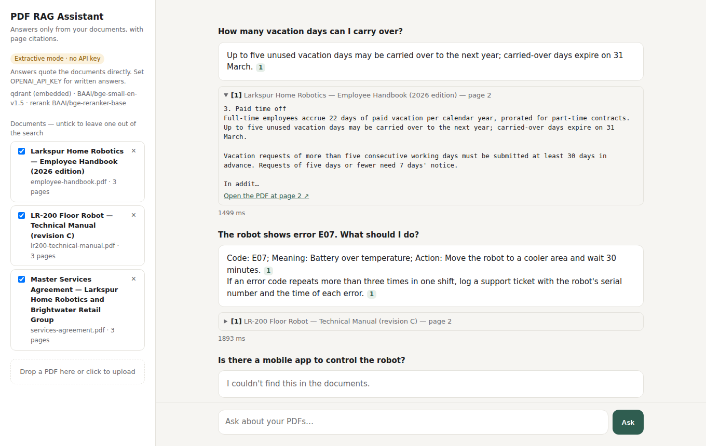
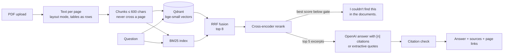

# PDF RAG Assistant

Ask questions about your PDFs and get answers that come **only** from the documents, with a citation to the exact page for every claim. When the documents don't cover a question, it says so instead of guessing.



- **Hybrid retrieval:** BM25 keyword search plus dense vectors in Qdrant, fused with Reciprocal Rank Fusion.
- **Cross-encoder reranking** (`BAAI/bge-reranker-base`) for ordering and for a relevance gate that refuses out-of-scope questions.
- **Grounded answers:** generated with OpenAI (Responses API) from numbered excerpts. Citations are validated, and an uncited answer is flagged.
- **Runs without an API key:** extractive mode quotes the best sentences or table rows, with the same citations.
- **Tables survive extraction.** Rows are rebuilt as `Code | Meaning | Action`, so a question about error E07 finds that row.
- **Measured:** an evaluation set of 36 questions, reported per retrieval method (below).
- **FastAPI backend, a small web UI, Docker, 38 tests and CI.**

## Quick start

```bash
pip install -r requirements.txt
uvicorn app.main:app --reload        # open http://localhost:8000
```

On first start the app indexes three sample PDFs. The embedding and reranker models (about 1.2 GB in total) download once and are cached. Drop your own PDFs into the sidebar.

For generated answers instead of quotes:

```bash
cp .env.example .env                 # then set OPENAI_API_KEY (and OPENAI_MODEL if you like)
```

With Docker (the models are baked into the image at build time):

```bash
docker build -t pdf-rag-assistant .
docker run -p 8000:8000 -v rag-data:/data --env-file .env pdf-rag-assistant
```

## How it works



1. **Extraction** (`rag/ingest.py`): pypdf in layout mode. Hard-wrapped lines are joined back into paragraphs, and table rows are kept as rows. Page footers are dropped.
2. **Chunking**: paragraphs are packed into chunks of about 600 characters. A heading stays with its paragraph (on its own line, so it never ends up inside an answer), one block overlaps between neighbouring chunks, and no chunk crosses a page, so every citation points to one page.
3. **Retrieval** (`rag/retrieve.py`): dense search in Qdrant (embedded by default, or a server via `QDRANT_URL`) and BM25, combined with RRF. BM25 catches exact codes, numbers and names; vectors catch paraphrases.
4. **Reranking and gate** (`rag/rerank.py`): a cross-encoder reads the question and each candidate together. If the best score is below `RAG_MIN_RERANK`, the app refuses without calling the LLM. Names that appear all over the corpus (the company, the product) are not evidence: when the question contains one, the candidates are scored again with the name masked (`rag/names.py`), and that score has to clear the gate too. "Who is the CEO of Larkspur Home Robotics?" matches half the documents on the company name, but "Who is the CEO of it?" matches nothing.
5. **Answer** (`rag/answer.py`): the model sees numbered excerpts with document and page, and must cite them as `[1]`. Citations to excerpts that don't exist are removed, and an answer with no citation is flagged instead of being presented as grounded.

## Evaluation

`python eval/run_eval.py` runs 36 answerable questions, worded differently from the documents, plus 12 questions the documents don't cover. A hit means the right document **and** the right page. Full output is in [eval/results.md](eval/results.md).

| retrieval | hit@1 | hit@3 | MRR@5 |
|---|---|---|---|
| BM25 | 89% | 97% | 0.928 |
| dense | 94% | 100% | 0.968 |
| hybrid (RRF) | 92% | 100% | 0.958 |
| **hybrid + reranker** | **100%** | **100%** | **1.000** |

In extractive mode (no LLM), 34/36 answers contain the expected fact and 36/36 cite the right page. The relevance gate refuses 11 of the 12 out-of-scope questions while keeping all 36 answerable ones. The one it lets through ("How many stores does Brightwater Retail Group have?") lands on a sentence about the stores listed in each statement of work; the LLM mode handles that one through its instruction to answer only from the excerpts.

The first version refused 4 of 6. A QA pass on it (see [QA history](#qa-history)) found two out-of-scope questions answered with unrelated text (the company's CEO, the robot's purchase price) and section headings leaking into answers. The name-masked gate and the heading fix came out of it. Twelve questions were added after the fix, six out-of-scope (five of them name the company or the product) and six answerable ones that name them, to check that it isn't tuned to the two that failed; the threshold stayed at -5.0.

## API

| method | path | |
|---|---|---|
| GET | `/api/health` | mode (`llm` / `extractive`), models, vector store |
| GET | `/api/documents` | indexed documents |
| POST | `/api/documents` | upload a PDF (`multipart/form-data`, field `file`) |
| DELETE | `/api/documents/{doc_id}` | remove a document |
| GET | `/api/documents/{doc_id}/file` | the original PDF (the UI opens it at the cited page) |
| POST | `/api/ask` | `{"question": "...", "doc_ids": ["..."]}`. `doc_ids` is optional and limits the search |

```json
{
  "text": "Up to five unused vacation days may be carried over to the next year; carried-over days expire on 31 March. [1]",
  "found": true,
  "mode": "extractive",
  "citations": [{"n": 1, "source": "employee-handbook.pdf", "page": 2, "doc_title": "...", "snippet": "..."}],
  "retrieval": [{"chunk_id": "c2a593b892:p2:c0", "fused": 0.0328, "dense": 0.759, "bm25": 9.783, "rerank": 5.309}],
  "latency_ms": 1618
}
```

## Configuration

All settings are environment variables (see `.env.example`).

| variable | default | |
|---|---|---|
| `OPENAI_API_KEY` | empty | enables generated answers |
| `OPENAI_MODEL` | `gpt-6-luna` | any Responses API model |
| `QDRANT_URL` | empty | empty = embedded Qdrant under `data/` |
| `EMBED_MODEL` | `BAAI/bge-small-en-v1.5` | any fastembed text model |
| `RERANK_MODEL` | `BAAI/bge-reranker-base` | `none` falls back to a dense-similarity gate |
| `RAG_MIN_RERANK` | `-5.0` | relevance gate (see the evaluation for the trade-off) |
| `RAG_CHUNK_CHARS` / `RAG_TOP_K` / `RAG_CANDIDATES` | `600` / `5` / `8` | chunk size, excerpts sent to the model, chunks reranked |

## Project layout

```
rag/          ingest · embeddings · store (Qdrant) · bm25 · retrieve · rerank · answer · pipeline · config
app/          FastAPI app and the single-page UI
eval/         questions.jsonl, run_eval.py, results.md
sample_docs/  generator for the sample PDFs (a fictional company) and the PDFs themselves
tests/        38 tests (ingest, retrieval, gate, answerability, LLM contract with a mocked client, API)
```

## Limits and next steps

- **Scanned PDFs** have no text layer and are rejected with a clear message. Adding OCR (e.g. Tesseract via `ocrmypdf`) before ingestion is the usual fix.
- The LLM path is covered by tests with a mocked OpenAI client; point it at your own key to see generated answers.
- Single-tenant: there is no login or per-user document separation. Qdrant payload filters by user or workspace are the natural extension.
- The reranker runs on CPU (about 1.5 s per question). A GPU, a smaller reranker or reranking fewer candidates bring that down.
- The sample corpus is small and synthetic. On a real corpus, re-run the evaluation with your own questions and tune `RAG_MIN_RERANK` from the table it prints.
- Extractive mode can put the right page's second-best sentence first (for example the late-payment and uptime questions in the evaluation). An LLM, or a sentence-level answer check, fixes that.

## QA history

- **29 Sep 2026, QA report on the first version:** 6 defects. Fixed: D-1 and D-2 (out-of-scope questions answered because they named the company or the product) with the name-masked relevance gate, and D-5 (section headings and the document title showing up in answers). Still open: D-3 and D-4 (right page, wrong sentence first in extractive mode) and D-6 (1–2 s per question on CPU). Each fix has a regression test in `tests/`.

## License

MIT
